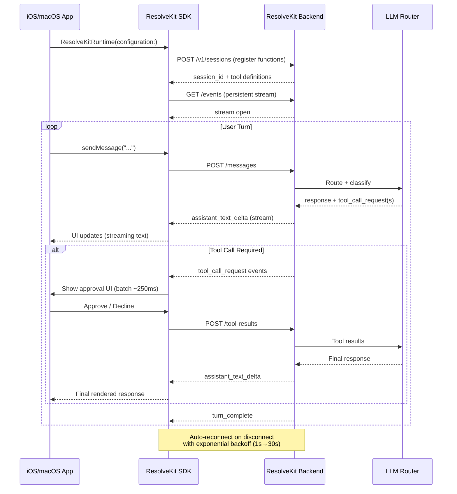

# ResolveKit iOS SDK

[](https://github.com/resolve-kit/resolvekit-ios-sdk/actions/workflows/ci.yml)
[](https://swiftpackageindex.com/resolve-kit/resolvekit-ios-sdk)
[](https://swiftpackageindex.com/resolve-kit/resolvekit-ios-sdk)
[](LICENSE)
[](https://cocoapods.org/pods/ResolveKit)

Swift SDK for embedding LLM-driven agent chat experiences in iOS and macOS apps.

**Support is moving into the product. ResolveKit is where it lands.** The SDK connects your app to a ResolveKit backend over an HTTP/3-first session event stream, replays in-flight turns after reconnects, and dispatches tool calls to native Swift functions you define. Use it when you want a conversational agent that can call device-side code (APIs, Keychain, platform services) on the user's behalf.

---

## Preview

| Chat View | Tool Approval | Connection States |
|-----------|--------------|-------------------|
|  |  |  |
| *Streaming chat with rich message rendering* | *Batch approval UI for function calls* | *Live reconnect with exponential backoff* |

> **Note:** Screenshot placeholders — replace `docs/assets/screenshot-*.png` with actual captures. See [Example/](Example/) for a runnable demo app you can screenshot.

---

## Architecture



---

## Requirements

- iOS 16+ / macOS 12+
- Swift 5.9+ toolchain
- Xcode 15.0+
- A running [ResolveKit backend](https://github.com/resolve-kit/resolvekit-backend) with a valid API key

---

## Installation

### Swift Package Manager (recommended)

Add the package in Xcode via **File → Add Package Dependencies**, then enter the repository URL:

```
https://github.com/resolve-kit/resolvekit-ios-sdk
```

Or add it manually to your `Package.swift`:

```swift
dependencies: [
    .package(url: "https://github.com/resolve-kit/resolvekit-ios-sdk", from: "1.5.0")
],
targets: [
    .target(
        name: "YourApp",
        dependencies: [
            .product(name: "ResolveKitUI", package: "resolvekit-ios-sdk")
        ]
    )
]
```

The package can be integrated into apps that remain in Swift 5 language mode, as long as the project is built with a Swift 5.9-or-newer toolchain.

### Product linking in Xcode

If your app integrates chat UI, link only `ResolveKitUI` in the app target.

- `ResolveKitUI` already depends on `ResolveKitCore` transitively.
- You can still `import ResolveKitCore` in source files for `AnyResolveKitFunction`, `JSONObject`, etc.
- If you explicitly link both products in one target and hit package linkage conflicts, remove the direct `ResolveKitCore` product linkage and keep only `ResolveKitUI`.
- For dynamic runtime loading on iOS, make sure `ResolveKitUI` is also embedded in the app:
  - Target → General → Frameworks, Libraries, and Embedded Content → `ResolveKitUI` = `Embed & Sign`
  - Or Build Phases → `Embed Frameworks` contains `ResolveKitUI.framework` with `CodeSignOnCopy`

## Minimum Viable Integration

Three steps to get a working chat runtime with one tool function, then embed it in SwiftUI, UIKit, or AppKit.

### Step 1: Define a function

```swift
import ResolveKitAuthoring

@ResolveKit(name: "get_local_time", description: "Returns the current local time.", timeout: 10, requiresApproval: false)
struct GetLocalTime: ResolveKitFunction {
    func perform() async throws -> String {
        let formatter = ISO8601DateFormatter()
        formatter.timeZone = .current
        formatter.formatOptions = [.withInternetDateTime, .withFractionalSeconds]
        return formatter.string(from: Date())
    }
}
```

### Step 2: Create the runtime

```swift
import ResolveKitUI

let runtime = ResolveKitRuntime(configuration: ResolveKitConfiguration(
    apiKeyProvider: { "rk_your_api_key" },
    functions: [GetLocalTime.self]
))
```

### Step 3: Embed the chat UI

#### SwiftUI

```swift
import SwiftUI
import ResolveKitUI

struct ContentView: View {
    @StateObject private var runtime = ResolveKitRuntime(configuration: ResolveKitConfiguration(
        apiKeyProvider: { "rk_your_api_key" },
        functions: [GetLocalTime.self]
    ))

    var body: some View {
        ResolveKitChatView(runtime: runtime)
    }
}
```

`ResolveKitChatView` calls `runtime.start()` automatically when it appears. It handles connection state, streaming text, tool approval UI, and the message composer.

#### UIKit

Use `ResolveKitChatViewController` when your app is built around `UIViewController`.
Present the chat view controller directly, for example in a modal `UINavigationController`, instead of adding it as a child and embedding its view manually.

```swift
import UIKit
import ResolveKitUI

final class ChatHostViewController: UIViewController {
    private let runtime = ResolveKitRuntime(configuration: ResolveKitConfiguration(
        apiKeyProvider: { "rk_your_api_key" },
        functions: [GetLocalTime.self]
    ))

    @IBAction func openChat(_ sender: Any?) {
        let chat = ResolveKitChatViewController(runtime: runtime)
        let navigationController = UINavigationController(rootViewController: chat)
        present(navigationController, animated: true)
    }
}
```

Convenience init:

```swift
let chat = ResolveKitChatViewController(configuration: ResolveKitConfiguration(
    apiKeyProvider: { "rk_your_api_key" },
    functions: [GetLocalTime.self]
))
```

`ResolveKitChatViewController` is a thin `UIHostingController` wrapper around `ResolveKitChatView`. The hosted view still starts the runtime automatically when it appears.

#### AppKit

Use `ResolveKitChatViewController` when your macOS app is built around `NSViewController`.

```swift
import AppKit
import ResolveKitUI

final class ChatHostViewController: NSViewController {
    private let runtime = ResolveKitRuntime(configuration: ResolveKitConfiguration(
        apiKeyProvider: { "rk_your_api_key" },
        functions: [GetLocalTime.self]
    ))

    @IBAction func openChat(_ sender: Any?) {
        let chat = ResolveKitChatViewController(runtime: runtime)
        presentAsModalWindow(chat)
    }
}
```

Convenience init:

```swift
let chat = ResolveKitChatViewController(configuration: ResolveKitConfiguration(
    apiKeyProvider: { "rk_your_api_key" },
    functions: [GetLocalTime.self]
))
```

On macOS, `ResolveKitChatViewController` is a thin `NSHostingController` wrapper around `ResolveKitChatView`. The hosted view still starts the runtime automatically when it appears.

---

## Defining Functions

There are two patterns for defining tool functions. For most open-source integrations, start with the `@ResolveKit` macro. Use manual `AnyResolveKitFunction` conformance only when you need lower-level control over schemas or dispatch.

### Pattern A: `@ResolveKit` macro (recommended)

Use this pattern when you want the shortest path from a typed Swift API to a registered ResolveKit tool. The macro generates the `Input` struct, JSON schema, and `invoke` dispatch boilerplate from a typed `perform` method.

Import `ResolveKitAuthoring`:

```swift
import ResolveKitAuthoring

@ResolveKit(name: String, description: String, timeout: Int? = nil, requiresApproval: Bool = true)
```

| Parameter | Required | Default | Description |
|-----------|----------|---------|-------------|
| `name` | Yes | — | Function name sent to the LLM. Use `snake_case`. |
| `description` | Yes | — | Plain-English description the LLM uses to decide when to call this function. |
| `timeout` | No | `nil` | Seconds before the call is considered failed. `nil` uses the backend's global setting. |
| `requiresApproval` | No | `true` | If `false`, the SDK skips the approval UI and executes immediately. |

**Rules:**

- Apply `@ResolveKit` to a `struct` only (not a class or enum).
- The struct must adopt `ResolveKitFunction`.
- The struct must contain exactly one method named `perform(...)`.
- `perform` must be `async throws`.

**Example:**

```swift
@ResolveKit(name: "send_message", description: "Send a text to a contact", timeout: 15, requiresApproval: true)
struct SendMessage: ResolveKitFunction {
    func perform(contactName: String, messageText: String, urgent: Bool) async throws -> Bool {
        // your implementation
        return true
    }
}
```

**What the macro generates:**

```swift
struct SendMessage: ResolveKitFunction {
    // your perform() stays untouched

    public static let resolveKitName = "send_message"
    public static let resolveKitDescription = "Send a text to a contact"
    public static let resolveKitTimeoutSeconds: Int? = 15
    public static let resolveKitRequiresApproval: Bool = true

    public struct Input: Codable, Sendable {
        public let contactName: String
        public let messageText: String
        public let urgent: Bool
    }

    public static let resolveKitParametersSchema: JSONObject = [
        "type": .string("object"),
        "properties": .object([
            "contactName": .object(["type": .string("string")]),
            "messageText": .object(["type": .string("string")]),
            "urgent":      .object(["type": .string("boolean")])
        ]),
        "required": .array([.string("contactName"), .string("messageText"), .string("urgent")])
    ]

    public static func invoke(arguments: JSONObject, context: ResolveKitFunctionContext) async throws -> JSONValue {
        do {
            let output = try await Self().perform(
                // coerced arguments
            )
            return try _resolveKitEncode(output)
        } catch {
            throw ResolveKitFunctionError.invalidArguments(error.localizedDescription)
        }
    }
}

extension SendMessage: AnyResolveKitFunction {}
```

### Pattern B: Manual conformance (`AnyResolveKitFunction`)

Use this pattern when you need custom JSON schemas, bespoke argument coercion, or dynamic dispatch that does not map cleanly to a typed `perform` method.

Import `ResolveKitCore` and conform your struct to `AnyResolveKitFunction`:

```swift
import ResolveKitCore

struct SetLights: AnyResolveKitFunction {
    static let resolveKitName = "set_lights"
    static let resolveKitDescription = "Turn lights on or off in a room"
    static let resolveKitRequiresApproval = true          // default; omit to use true
    static let resolveKitTimeoutSeconds: Int? = 30
    static let resolveKitParametersSchema: JSONObject = [
        "type": .string("object"),
        "properties": .object([
            "room": .object(["type": .string("string")]),
            "on":   .object(["type": .string("boolean")])
        ]),
        "required": .array([.string("room"), .string("on")])
    ]

    static func invoke(arguments: JSONObject, context: ResolveKitFunctionContext) async throws -> JSONValue {
        guard
            let room = arguments["room"].flatMap(TypeResolver.coerceString),
            let on   = arguments["on"].flatMap(TypeResolver.coerceBool)
        else {
            throw ResolveKitFunctionError.invalidArguments("Expected room:String and on:Bool")
        }
        return .string("Set \(room) lights to \(on ? 100 : 0)%")
    }
}
```

**Required static members:**

| Member | Type | Required | Default | Purpose |
|--------|------|----------|---------|---------|
| `resolveKitName` | `String` | Yes | — | Function identifier sent to the LLM. Use `snake_case`. |
| `resolveKitDescription` | `String` | Yes | — | Plain-English description the LLM uses to decide when to call this function. |
| `resolveKitParametersSchema` | `JSONObject` | Yes | — | JSON Schema object describing the function's input parameters. |
| `resolveKitRequiresApproval` | `Bool` | No | `true` | If `true`, the SDK shows an approval UI before executing. Set to `false` for read-only, non-destructive tools. |
| `resolveKitTimeoutSeconds` | `Int?` | No | `nil` | Seconds before the tool call is considered failed. `nil` uses the backend's global setting. |

**`invoke` signature:**

```swift
static func invoke(arguments: JSONObject, context: ResolveKitFunctionContext) async throws -> JSONValue
```

`arguments` is a `[String: JSONValue]` dictionary matching the schema you declared. `context` carries session metadata (not currently used in most tools). Return any `JSONValue`; throw `ResolveKitFunctionError` on invalid input.

---

## Supported Parameter Types

### Input (`perform` parameters in macro pattern)

| Swift type | JSON Schema type | LLM coercion |
|------------|-----------------|--------------|
| `String` | `"string"` | Tolerates numbers/bools |
| `Bool` | `"boolean"` | Tolerates `1`/`0`/`"true"`/`"false"` |
| `Int`, `Int8`…`UInt64` | `"integer"` | Truncates `3.0 → 3` |
| `Double`, `Float`, `CGFloat` | `"number"` | — |
| `T?` (any of the above) | Same as `T`, not in `required` | `nil` if key absent |
| `[T]` | `"array"` with `"items"` schema | Codable round-trip |
| `[[T]]` | Nested array schema | Codable round-trip |
| `[K: V]` | `"object"` | Codable round-trip |
| Nested `Codable` struct | `"object"` | Codable round-trip |

**Optional parameters** (`T?`) are automatically excluded from the `required` array, so the LLM knows it can omit them.

### Output (return type of `perform`)

Any `Encodable` type works. The return value is encoded to `JSONValue` and sent back to the backend as the tool result:

```swift
func perform(...) async throws -> String { ... }       // ✅
func perform(...) async throws -> Bool { ... }         // ✅
func perform(...) async throws -> Int { ... }          // ✅
func perform(...) async throws -> MyStruct { ... }     // ✅ (must be Encodable)
func perform(...) async throws -> [String] { ... }     // ✅
func perform(...) async throws -> Void { ... }         // ✅ (sends null)
```

---

## Configuration Reference

`ResolveKitConfiguration` is passed to `ResolveKitRuntime` at initialization and is immutable after that point.

```swift
ResolveKitConfiguration(
    baseURL: URL = ResolveKitDefaults.baseURL,
    apiKeyProvider: @Sendable () -> String?,
    deviceIDProvider: @Sendable () -> String? = { nil },
    llmContextProvider: @Sendable () -> JSONObject = { [:] },
    availableFunctionNamesProvider: (@Sendable () -> [String])? = nil,
    localeProvider: @Sendable () -> String? = { nil },
    preferredLocalesProvider: (@Sendable () -> [String])? = nil,
    functions: [any AnyResolveKitFunction.Type] = [],
    functionPacks: [any ResolveKitFunctionPack.Type] = []
)
```

### `baseURL`

**Type:** `URL` | **Required:** No | **Default:** `ResolveKitDefaults.baseURL`

Base URL of the ResolveKit backend. By default, `ResolveKitDefaults.baseURL` reads `RESOLVEKIT_BASE_URL` from the process environment and falls back to `https://agent.example.com`. Override only when self-hosting:

```swift
baseURL: URL(string: "https://your-backend.example.com")!
```

### `apiKeyProvider`

**Type:** `@Sendable () -> String?` | **Required:** Yes

Called at the start of each session. Return `nil` or an empty string to block connection:

```swift
apiKeyProvider: { KeychainManager.shared.apiKey }
```

Security guidance:

- Do not hardcode production API keys in source.
- Prefer key retrieval from Keychain or your secure config layer.
- For debug builds, use a temporary/dev key path gated by build configuration.

### `deviceIDProvider`

**Type:** `@Sendable () -> String?` | **Required:** No | **Default:** `{ nil }`

Stable device or user identifier used to correlate sessions across app launches. If `nil` is returned, the SDK generates and persists a UUID automatically. Provide your own to tie sessions to a specific user account:

```swift
deviceIDProvider: {
    if let id = UserDefaults.standard.string(forKey: "device_id") { return id }
    let id = UUID().uuidString
    UserDefaults.standard.set(id, forKey: "device_id")
    return id
}
```

### `llmContextProvider`

**Type:** `@Sendable () -> JSONObject` | **Required:** No | **Default:** `{ [:] }`

Custom JSON context sent as `llm_context` during session creation. This context is injected into router classification, prompt assembly, and knowledge-base query shaping on the backend. Use it to pass user preferences, location, app state, or any signal the agent needs at routing time:

```swift
llmContextProvider: {
    [
        "location": .object([
            "city": .string("Vilnius"),
            "country": .string("LT"),
            "lat": .number(54.6872),
            "lon": .number(25.2797)
        ]),
        "network_type": .string("wifi"),
        "is_traveling": .bool(false)
    ]
}
```

### `availableFunctionNamesProvider`

**Type:** `(@Sendable () -> [String])?` | **Required:** No | **Default:** `nil`

Optional allowlist of function names for the current session. If `nil`, the SDK sends all locally registered function names. If provided, the SDK intersects the returned names with locally registered functions before sending to the backend. Use this to scope available tools per user or feature flag:

```swift
availableFunctionNamesProvider: { userPlan == .pro ? allFunctionNames : basicFunctionNames }
```

### `localeProvider`

**Type:** `@Sendable () -> String?` | **Required:** No | **Default:** `{ nil }`

Provides the preferred locale for the chat session as a BCP 47 language tag (e.g. `"en"`, `"lt"`, `"fr-CA"`). If `nil`, the SDK resolves locale from `preferredLocalesProvider` or `Locale.preferredLanguages`. Use this to pin the chat language regardless of system locale:

```swift
localeProvider: { currentUser.preferredLanguage }
```

### `preferredLocalesProvider`

**Type:** `(@Sendable () -> [String])?` | **Required:** No | **Default:** `nil`

Provides an ordered list of preferred BCP 47 locale tags used when `localeProvider` returns `nil`. If `nil`, the SDK falls back to `Locale.preferredLanguages`. Use this to substitute app-level locale preferences for the system list:

```swift
preferredLocalesProvider: { appSettings.preferredLanguages }
```

### `functions`

**Type:** `[any AnyResolveKitFunction.Type]` | **Required:** No | **Default:** `[]`

Inline list of tool function types available to the agent. Provide types (not instances):

```swift
functions: [SetLights.self, GetWeather.self, GetLocalTime.self]
```

### `functionPacks`

**Type:** `[any ResolveKitFunctionPack.Type]` | **Required:** No | **Default:** `[]`

Optional groups of tool functions defined in a dedicated module. See [Function Packs](#function-packs) below.

**Client operational context** (platform, OS version, app version, app build, SDK version) is sent automatically in the SDK-managed `client` payload — no configuration needed.

---

## Runtime API

`ResolveKitRuntime` is a `@MainActor ObservableObject`. All published properties update on the main thread and are safe to bind directly in SwiftUI views or through `ResolveKitChatViewController` in UIKit/AppKit hosts.

### Published properties

```swift
// Chat transcript — array of user and assistant messages in chronological order
@Published public private(set) var messages: [ResolveKitChatMessage]

// Current session-stream connection phase (see Connection States below)
@Published public private(set) var connectionState: ResolveKitConnectionState

// True while the agent is processing a turn (streaming response or executing tools)
@Published public private(set) var isTurnInProgress: Bool

// Current active tool call awaiting approval (nil if none)
@Published public private(set) var pendingToolCall: ResolveKitPendingToolCall?

// Live checklist of tool calls in the current batch
@Published public private(set) var toolCallChecklist: [ToolCallChecklistItem]

// Aggregate approval state of the current tool call batch
@Published public private(set) var toolCallBatchState: ResolveKitToolCallBatchState

// Historical record of all tool call batches, including completed ones
@Published public private(set) var toolCallBatches: [ToolCallChecklistBatch]

// Debug log of runtime lifecycle events (session creation, event frames, errors)
@Published public private(set) var executionLog: [String]

// Last unrecoverable error message, or nil if none
@Published public private(set) var lastError: String?

// Active chat color theme fetched from the backend
@Published public private(set) var chatTheme: ResolveKitChatTheme

// Current color scheme mode applied to ResolveKitChatView
@Published public private(set) var appearanceMode: ResolveKitAppearanceMode

// Active BCP 47 locale tag used for outgoing turns and UI strings
@Published public private(set) var currentLocale: String

// Navigation bar title shown in ResolveKitChatView
@Published public private(set) var chatTitle: String

// Placeholder text shown in the message composer input field
@Published public private(set) var messagePlaceholder: String
```

### Methods

```swift
// Start the session: register functions → create session → open persistent event stream.
// Called automatically by ResolveKitChatView; call manually only when driving a custom UI.
func start() async throws

// Tear down the current session and start a fresh one, clearing the message history.
// Bound to the reload button in ResolveKitChatView's toolbar.
func reloadWithNewSession() async

// Force runtime context refresh for the active session (re-sends llmContext, locale, functions).
func refreshSessionContext() async throws

// Send a user message. No-op if a turn is already in progress.
func sendMessage(_ text: String) async

// Batch tool approval — approve or decline all pending tool calls in the current batch.
func approveToolCallBatch() async
func declineToolCallBatch() async

// Backward-compatible single-call wrappers (delegates to batch approve/decline).
func approveCurrentToolCall() async
func denyCurrentToolCall() async

// Override the active appearance mode at runtime.
// .system follows the device setting; .light or .dark force a specific scheme.
func setAppearance(_ mode: ResolveKitAppearanceMode)

// Override the chat locale at runtime.
// Pass a BCP 47 tag (e.g. "lt", "fr-CA") or nil to revert to the configured provider.
// Updates currentLocale, chatTitle, and messagePlaceholder from the backend.
func setLocale(_ locale: String?) async
```

### Tool-call UX

Tool calls are batched by a ~250ms coalescing window: rapid `tool_call_request` events are grouped into one checklist, and permission is granted once per batch via **Approve All** / **Decline All**.

Each checklist row tracks status independently:

| Status | Meaning |
|--------|---------|
| `pendingApproval` | Waiting for user or auto-approval |
| `running` | Currently executing |
| `completed` | Finished successfully |
| `cancelled` | Skipped or user declined |
| `failed(error)` | Threw an error during execution |

---

## Connection States

`ResolveKitConnectionState` describes the persistent event-stream lifecycle. Observe `runtime.connectionState` to drive custom UI (e.g. a connection banner or reconnect button).

```
idle → registering → connecting → active
                               ↘ reconnecting → reconnected → active
                               ↘ failed          (unrecoverable error)
                               ↘ blocked         (missing API key or incompatible SDK)
```

| State | Description |
|-------|-------------|
| `idle` | Runtime created but `start()` not yet called |
| `registering` | Registering functions with the backend |
| `connecting` | Session created; opening the persistent event stream |
| `active` | Session event stream connected; agent ready to receive messages |
| `reconnecting` | Event stream dropped; SDK will retry automatically with exponential backoff (1s, 2s, 4s … 30s max) |
| `reconnected` | Reconnect succeeded; resuming active session |
| `failed` | Unrecoverable error; check `lastError` for details |
| `blocked` | Connection refused due to missing API key or incompatible SDK version |

At startup, the runtime calls `/v1/sdk/compat` and transitions to `blocked` if:
- The current SDK major version is not supported by the backend, or
- The current SDK version is below the server minimum.

---

## Function Packs

Define ResolveKit-only tool functions in a dedicated module rather than mixing them into app feature code. Wrap the group in a `ResolveKitFunctionPack`:

```swift
import ResolveKitCore

enum CommerceResolveKitPack: ResolveKitFunctionPack {
    static let packName = "commerce_pack"
    static let supportedPlatforms: [ResolveKitPlatform] = [.ios, .macos]
    static let functions: [any AnyResolveKitFunction.Type] = [
        GetSubscriptionStatus.self,
        UpgradeSubscription.self
    ]
}
```

Register via `functionPacks` in `ResolveKitConfiguration`:

```swift
functionPacks: [CommerceResolveKitPack.self]
```

The backend receives `pack_name` and `source` metadata per registered function, which enables per-pack telemetry and eligibility filtering.

---

## Wire Protocol

The SDK communicates with the backend using an HTTP session stream:

```
Client → Server:  POST /messages | POST /tool-results
Server → Client:  GET /events (assistant_text_delta | tool_call_request | turn_complete | error)
```

The SDK keeps one persistent event stream per session, resumes it with the last seen event cursor after reconnects, and replays missed frames before continuing the active turn.

---

## Package Structure

```
Sources/
  ResolveKitCore/        Protocols, registry, JSON types, TypeResolver, definitions
  ResolveKitAuthoring/   @ResolveKit macro declaration, ResolveKitFunction protocol
  ResolveKitMacros/      Swift compiler plugin -- @ResolveKit expansion
  ResolveKitNetworking/  HTTP (function registration, session, event stream)
  ResolveKitUI/          ResolveKitRuntime, ResolveKitChatView, ResolveKitChatViewController, Configuration
  ResolveKitCodegen/     Build-time CLI that generates ResolveKitAutoRegistry.swift
Plugins/
  ResolveKitPlugin/      SPM build tool plugin — runs ResolveKitCodegen at build time
Tests/
  ResolveKitCoreTests/   Registry, TypeResolver, ResolveKitDefinition
  ResolveKitMacroTests/  Macro expansion correctness
  ResolveKitIntegrationTests/ Full dispatch pipeline
```

Import only what you need:

| Import | Gives you |
|--------|-----------|
| `ResolveKitCore` | Runtime-safe protocols, registry, JSON/value types |
| `ResolveKitAuthoring` | Macro authoring layer for defining tools with typed `perform` methods |
| `ResolveKitUI` | `ResolveKitRuntime`, `ResolveKitChatView`, `ResolveKitChatViewController`, `ResolveKitConfiguration` — for app code |

`ResolveKitUI` re-exports `ResolveKitCore` transitively, so most app targets only need `import ResolveKitUI`.

---

## Compatibility + Eligibility Notes

- Session creation sends:
  - `client` context (`platform`, `os_version`, `app_version`, `sdk_version`, etc.)
  - `llm_context` (developer-defined JSON from `llmContextProvider`)
  - `available_function_names`
- Runtime context can be refreshed for active sessions via `PATCH /v1/sessions/{session_id}/context`.
- Function registration supports optional metadata:
  - `availability` (`platforms`, `min/max_os_version`, `min/max_app_version`)
  - `source` and `pack_name`
- Backend filters tools per session and only exposes eligible functions to the LLM.

---

## Sample App

The repository includes a reference iOS sample app at `sample/ResolveKitSample`.

It mirrors the Android sample structure:

1. Configuration screen where host URL + API key are required before continue.
2. Capabilities screen with supported tool calls, test prompts, and an `Open Chat` CTA.
3. Visible host-app state that changes after tool calls (vibe, mascot, confetti, laser state).

Run it locally:

```bash
cd sample/ResolveKitSample
xcodegen generate
open ResolveKitSample.xcodeproj
```

Then run the `ResolveKitSample` scheme on an iOS Simulator.

---

## Running Tests

```bash
# All tests
swift test

# By suite
swift test --filter ResolveKitCoreTests
swift test --filter ResolveKitMacroTests
swift test --filter ResolveKitIntegrationTests
```

---

## iOS Integration Troubleshooting

- **`Missing API key`**: `apiKeyProvider` returned `nil` or an empty string at runtime.
- **Xcode package linkage conflict** when adding multiple ResolveKit products: link `ResolveKitUI` for app UI targets and remove any redundant direct `ResolveKitCore` product linkage.
- **App aborts at launch** (`__abort_with_payload`, `dyld`): `ResolveKitUI.framework` is linked but not embedded. Verify it is set to `Embed & Sign` and appears under `<YourApp>.app/Frameworks`.
- **Chat stuck in `blocked` state**: SDK version is incompatible with the backend. Update the SDK package to the latest version.
- **`chatTitle` or `messagePlaceholder` shows defaults**: The session locale may not be resolving correctly. Call `setLocale(_:)` explicitly or verify `localeProvider` returns the expected tag.
